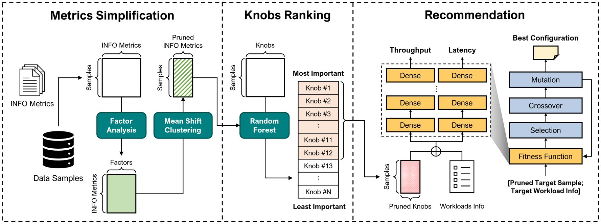

# DARK

Automatic Parameters Tuning System for Redis based on Deep Learning



## Environments

- python: 3.7
- pytorch: 1.7.1
- redis: 5.0.2
- memtier_benchmark
- OS: Ubuntu 16.04.7 LTS (in GCP)
- CPU: Intel® Xeon® CPU @ 2.00GHz
- RAM: DIMM 16G

## What is Redis?

Redis is often referred as a *data structures* server. What this means is that Redis provides access to mutable data structures via a set of commands, which are sent using a *server-client* model with TCP sockets and a simple protocol. So different processes can query and modify the same data structures in a shared way.

Data structures implemented into Redis have a few special properties:

- Redis cares to store them on disk, even if they are always served and modified into the server memory. This means that Redis is fast, but that is also non-volatile.
- Implementation of data structures stress on memory efficiency, so data structures inside Redis will likely use less memory compared to the same data structure modeled using an high level programming language.
- Redis offers a number of features that are natural to find in a database, like replication, tunable levels of durability, cluster, high availability.

Another good example is to think of Redis as a more complex version of memcached, where the operations are not just SETs and GETs, but operations to work with complex data types like Lists, Sets, ordered data structures, and so forth.

If you want to know more, this is a list of selected starting points:

- Introduction to Redis data types. http://redis.io/topics/data-types-intro
- Try Redis directly inside your browser. [http://try.redis.io](http://try.redis.io/)
- The full list of Redis commands. http://redis.io/commands
- There is much more inside the Redis official documentation. http://redis.io/documentation

## Workloads

- \# of Requests
  - Light : 1,000,000
  - Heavy : 2,000,000
- Key size of key-value data: 16 B
- Value size of key-value data
  - Light : 64 B
  - Heavy : 1 KB
- Ratio

| SET : GET | INSERT : UPDATE | INSERT : UPDATE : GET |
| :-------: | :-------------: | :-------------------: |
|   8 : 2   |      1 : 1      |     40 : 40 : 20      |
|   8 : 2   |      1 : 4      |     16 : 64 : 20      |
|   8 : 2   |      1 : 9      |      8 : 72 : 20      |
|   5 : 5   |      1 : 1      |     25 : 25 : 50      |
|   5 : 5   |      1 : 4      |     10 : 40 : 50      |
|   5 : 5   |      1 : 9      |      5 : 45 : 50      |
|   2 : 8   |      1 : 1      |     10 : 10 : 80      |
|   2 : 8   |      1 : 4      |      4 : 16 : 80      |
|   2 : 8   |      1 : 9      |      2 : 18 : 80      |

## Redis-Data-Generation

Since there is no available Redis workload dataset, it is required to carry out a step of generating data samples required for training.

https://github.com/addb-swstarlab/redis-sample-generation

## How to run?

Execute the following code for learning single mode

```bash
python double_main.py --target <target workload number> --persistence <RDB or AOF> --cluster <k-means or ms or gmm> --rki <RF or lasso or XGB> --topk <top knobs> --atr <False or True>
```

Execute the following code for learning grid search mode

```bash
python run_main.py
```

- Change value in OrderDict before the execution

```bash
python GA.py --target <target workload number> --persistence <RDB or AOF> --topk <top knobs> --path <dense path> --sk <save knobs path> --num <each dense best model number>
```

- ex)  python GA.py  --target 1 --persistence AOF --topk 12 --path 20210908-00 --sk 20210908-00 --num 1 15
  - num <throughput (ops/sec)> <latency (ms)>

## Paper

Will update after acceptance journal

